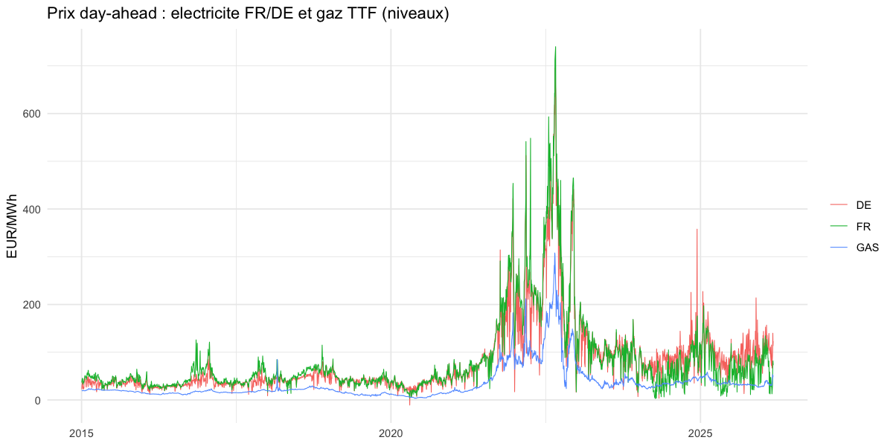
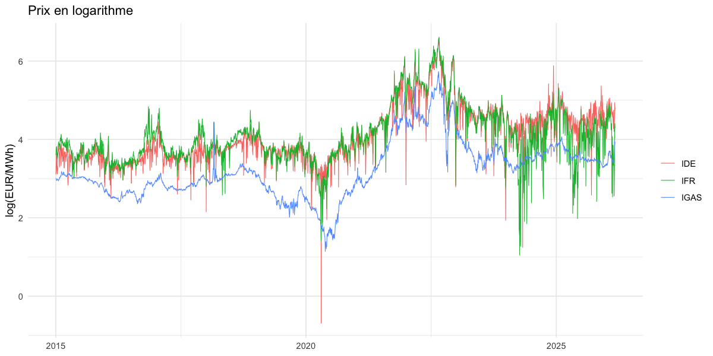
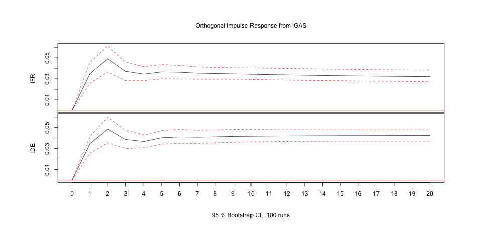

# Relation d'équilibre entre les prix de gros de l'électricité (France, Allemagne) et le prix du gaz

### Projet d'économétrie — ENM 2025-2026

*Groupe : [Nom 1], [Nom 2], [Nom 3]*
*Données quotidiennes 2015-2026 — Logiciel : R*

---

## 1. Introduction et problématique

Sur les marchés de gros européens (day-ahead), le prix de l'électricité est, la plupart du temps,
fixé par la centrale marginale appelée pour équilibrer l'offre et la demande. En Europe continentale,
cette unité marginale est très fréquemment une centrale à gaz : le **merit order** prédit donc une
relation directe entre le prix spot de l'électricité et le prix du gaz naturel. Par ailleurs, le
couplage des marchés (market coupling) et les interconnexions transfrontalières lient étroitement les
prix français et allemand.

Ce travail teste empiriquement ces deux mécanismes à l'aide des méthodes de séries temporelles
non stationnaires (racine unitaire, cointégration, modèle à correction d'erreur). Trois questions
structurent l'analyse :

1. Existe-t-il une relation d'équilibre de long terme entre les trois prix (élec. FR, élec. DE, gaz) ?
2. Existe-t-il une relation d'équilibre entre les marchés français et allemand de l'électricité ?
3. Quelle est la dynamique des prix (vitesse d'ajustement, causalité, propagation des chocs) ?

## 2. Données et construction de l'échantillon

| Série | Source | Unité | Fréquence native |
|---|---|---|---|
| Prix élec. France, day-ahead | European wholesale electricity price | EUR/MWh | quotidienne, 7j/7 |
| Prix élec. Allemagne, day-ahead | idem | EUR/MWh | quotidienne, 7j/7 |
| Prix gaz **TTF** day-ahead (London close) | Gas_price_2015-2026 | EUR/MWh | jours ouvrés |

Le prix du gaz n'étant coté que les jours ouvrés (ni week-ends, ni fériés), alors que l'électricité
cote tous les jours, **l'échantillon commun** est obtenu par jointure interne sur les dates de
cotation communes. Il comprend **2 826 observations quotidiennes du 2 janvier 2015 au 6 mars 2026**.

**Transformation logarithmique.** Toutes les séries sont passées en logarithme : (i) cela stabilise
la variance, considérable du fait de la crise énergétique ; (ii) les coefficients de long terme
s'interprètent alors comme des **élasticités**. Une unique cotation négative (Allemagne, −10,7 EUR/MWh,
surplus d'électricité renouvelable) a été ramenée à un faible seuil positif (0,5) pour autoriser le
passage au log — impact nul sur 2 826 observations.

**Statistiques descriptives.**

| | Moyenne | Écart-type | Min | Médiane | Max |
|---|---|---|---|---|---|
| Élec. FR | 83,2 | 88,3 | 2,9 | 52,7 | 740,1 |
| Élec. DE | 80,5 | 79,1 | −10,7 | 49,3 | 695,3 |
| Gaz TTF | 34,3 | 35,8 | 3,1 | 22,1 | 308,0 |

Corrélations en log : FR–DE 0,86 ; DE–gaz 0,86 ; FR–gaz 0,82.

La figure fait apparaître trois régimes : (i) 2015-2020, prix bas et stables ; (ii) creux du
1er confinement COVID (printemps 2020) ; (iii) **crise énergétique** mi-2021 à 2023, avec un pic
à 740 EUR/MWh fin 2022 (réduction des livraisons russes, puis guerre en Ukraine), suivie d'une
détente vers un « nouveau normal » plus élevé et plus volatil.

En logarithme, le co-mouvement des trois séries est frappant, ce qui motive l'analyse de cointégration.

**Choix de l'échantillon.** Conformément à l'énoncé, le choix de l'échantillon est discuté
(section 3). Nous retenons l'**échantillon complet 2015-2026**, en contrôlant les deux chocs
exogènes par des variables muettes : `crise` (1 du 01/07/2021 au 30/06/2023) et `covid`
(1 de mars à mai 2020). Ce choix maximise l'information et conserve l'épisode économiquement le
plus instructif (la crise), au prix d'une discussion approfondie de l'ordre d'intégration.

## 3. Ordre d'intégration : tests de racine unitaire

Tests ADF (H0 : racine unitaire), KPSS (H0 : stationnarité), sur les niveaux (log) et les
différences premières. Seuil 5 %.

| Série | ADF niveau | KPSS niveau | ADF Δ | Conclusion |
|---|---|---|---|---|
| log Gaz | −2,18 (non rejet) | 10,1 (rejet) | −43,0 (rejet) | **I(1)** net |
| log Élec. FR | −7,99 (rejet) | 6,90 (rejet) | −49,2 (rejet) | conflit |
| log Élec. DE | −8,96 (rejet) | 15,5 (rejet) | −53,5 (rejet) | conflit |

Le **gaz est clairement I(1)**. Pour l'électricité, ADF et KPSS se contredisent. Ce conflit, **persistant
sur tous les sous-échantillons** (pré- et post-crise), n'est pas un artefact de la crise : il reflète
la **nature physique des prix**. L'électricité n'est pas stockable → son prix spot revient rapidement
vers le coût marginal (forte réversion à la moyenne haute fréquence, que l'ADF capte → rejet de la
racine unitaire). Mais une composante de basse fréquence persiste (héritée de la tendance du gaz, que
le KPSS détecte → rejet de la stationnarité). Le gaz, lui, est stockable et se comporte comme une
marche aléatoire.

**Test de Zivot-Andrews** (racine unitaire avec rupture endogène) :

| Série | Statistique | Valeur critique 5 % | Rupture détectée | Conclusion |
|---|---|---|---|---|
| log Élec. FR | −10,82 | −5,08 | 06/08/2021 | stationnaire autour d'une rupture |
| log Élec. DE | −13,52 | −5,08 | 17/08/2021 | stationnaire autour d'une rupture |
| log Gaz | −4,07 | −5,08 | 03/03/2021 | **I(1) même avec rupture** |

Les ruptures tombent toutes en 2021, confirmant l'origine « crise » du décalage de niveau.

**Décision méthodologique.** Nous traitons les trois séries comme **I(1)** pour l'analyse de
cointégration. Cette décision est justifiée par : (i) le test KPSS qui rejette nettement la
stationnarité ; (ii) le mécanisme économique du merit order, qui implique que l'électricité hérite
de la tendance stochastique du gaz ; (iii) le fort co-mouvement de basse fréquence (figure 2). Le
conflit avec l'ADF est documenté comme une limite (section 6). La procédure de Johansen détermine
de toute façon le rang de cointégration de manière endogène.

## 4. Cointégration

### 4.1 Engle-Granger (relation statique)

Régression de long terme :

$$ \log P^{FR} = 0{,}63 + 0{,}30\,\log P^{Gaz} + 0{,}61\,\log P^{DE} $$

Le test ADF sur les résidus (τ = −13,9, très inférieur aux valeurs critiques de cointégration)
**rejette la non-cointégration** : les résidus sont I(0). Le prix français de long terme est tiré
à 0,61 par le prix allemand (couplage) et à 0,30 par le gaz (exposition directe).

### 4.2 Johansen à trois variables — *Question 1*

Spécification : VECM à K = 3 retards (critère de Schwarz), constante dans la relation de
cointégration, muettes crise/COVID en exogène.

| H0 | Stat. de la trace | VC 5 % | VC 1 % | Décision |
|---|---|---|---|---|
| r = 0 | 416,9 | 34,9 | 41,1 | rejet |
| r ≤ 1 | 164,1 | 20,0 | 24,6 | rejet |
| r ≤ 2 | 12,6 | 9,2 | 13,0 | non rejet à 1 % |

Le **rang de cointégration est r = 2** (au seuil de 1 %). Avec trois variables et deux relations
d'équilibre, le système ne possède qu'**une seule tendance stochastique commune** — le gaz, seule
série véritablement I(1). **Réponse à la question 1 : oui**, il existe des relations d'équilibre de
long terme entre les trois prix, organisées autour du gaz comme moteur commun. (Au seuil de 5 %, le
test frôle r = 3, soit la stationnarité du système — manifestation directe de la réversion de
l'électricité discutée en section 3.)

### 4.3 Johansen bivarié FR–DE — *Question 2*

Le test de la trace rejette nettement r = 0 (251,9 > 20,0). La relation d'équilibre normalisée est
quasiment **un pour un** :

$$ \log P^{FR} \approx 0{,}82\,\log P^{DE} + \text{const.} $$

**Réponse à la question 2 : oui**, les marchés français et allemand sont en équilibre de long terme,
reflet du couplage de marché et des interconnexions.

## 5. Dynamique : modèle à correction d'erreur (VECM) — *Question 3*

Les deux relations de long terme estimées (r = 2) sont des relations **électricité–gaz** :

$$ \log P^{FR} = 2{,}17 + 0{,}57\,\log P^{Gaz}, \qquad \log P^{DE} = 1{,}53 + 0{,}79\,\log P^{Gaz} $$

L'élasticité de long terme au gaz est **plus forte en Allemagne (0,79) qu'en France (0,57)** :
cohérent avec un mix allemand plus gazo-dépendant, amorti en France par le parc nucléaire.

**Coefficients d'ajustement (α) — résultat central :**

| Équation | α vers équil. FR-gaz | α vers équil. DE-gaz |
|---|---|---|
| Δ log Élec. FR | **−0,145*** (≈14,5 %/j) | −0,068*** |
| Δ log Élec. DE | 0,024 (n.s.) | **−0,272*** (≈27 %/j) |
| Δ log Gaz | −0,007 (n.s.) | 0,006 (n.s.) |

Le **gaz ne réagit pas** aux déséquilibres : il est **faiblement exogène** et pilote le système. Ce
sont les prix de l'électricité qui réalisent l'essentiel de la correction vers l'équilibre, et
rapidement (l'Allemagne corrige environ un quart de l'écart par jour). Ce résultat confirme le gaz
comme unique tendance commune et valide le mécanisme du merit order.

**Causalité de Granger :** le gaz cause les prix de l'électricité au sens de Granger (F = 40,1 ;
p < 0,001) ; on observe en outre une **causalité bidirectionnelle FR ↔ DE** (couplage). À court terme,
la répercussion d'un choc gaz sur l'électricité est immédiate (coefficient de Δlog Gaz retardé :
+0,42 sur FR, +0,36 sur DE ; significatifs).

La fonction de réponse impulsionnelle montre qu'un choc sur le gaz élève les prix de l'électricité,
avec un pic vers le 2ᵉ jour, puis un effet **permanent** (≈ +3 % pour la France, +4 % pour
l'Allemagne) — signature de la cointégration : le choc déplace durablement l'équilibre.

**Réponse à la question 3 :** la dynamique est gouvernée par le gaz (exogène), auquel les prix de
l'électricité s'ajustent rapidement ; les marchés français et allemand s'influencent mutuellement,
et l'Allemagne, plus exposée au gaz, réagit plus fortement.

## 6. Diagnostics et limites

| Test | Statistique | p-value | Lecture |
|---|---|---|---|
| Stabilité (racine max.) | 0,993 | — | **stable** (< 1) |
| Autocorrélation (Portmanteau) | 320,5 | < 0,001 | autocorrélation résiduelle |
| Normalité (Jarque-Bera) | 299 020 | < 0,001 | non-normalité (queues épaisses) |
| Hétéroscédasticité (ARCH) | 2 132,9 | < 0,001 | volatilité groupée |

Le modèle est **dynamiquement stable**. La non-normalité et les effets ARCH sont **attendus pour des
prix énergétiques quotidiens** (pics, volatilité groupée) et n'invalident pas la consistance des
estimateurs de cointégration ; ils invitent toutefois à la prudence sur l'inférence. **Limites et
extensions :** (i) l'autocorrélation résiduelle pourrait être réduite par un nombre de retards plus
élevé (l'AIC suggérait K = 9) ; (ii) la volatilité groupée justifierait une extension à un modèle
**GARCH multivarié** ; (iii) le conflit ADF/KPSS sur l'électricité (réversion à la moyenne)
constitue la principale réserve théorique, atténuée ici par le raisonnement économique et le test KPSS.

## 7. Conclusion

| Question | Réponse |
|---|---|
| 1. Équilibre entre les 3 prix ? | **Oui** — rang de cointégration 2 ; le gaz est l'unique tendance commune. |
| 2. Équilibre FR ↔ DE ? | **Oui** — relation de long terme quasi 1:1 ; marchés couplés. |
| 3. Dynamique ? | Gaz exogène moteur ; l'électricité s'ajuste vite (14-27 %/j) ; répercussion immédiate et permanente d'un choc gaz ; feedback FR ↔ DE. |

L'analyse confirme empiriquement le mécanisme du merit order : le prix du gaz constitue l'ancrage de
long terme des prix de gros de l'électricité en France et en Allemagne, et le couplage des deux
marchés se traduit par une relation d'équilibre quasi unitaire entre eux.

---

### Annexe — reproductibilité

Scripts R (dossier `rendu/`, environnement isolé `renv`) :
`01_donnees_et_exploration.R` · `02_racine_unitaire.R` · `03_cointegration.R` ·
`04_vecm_dynamique.R` · `05_diagnostics.R`.
